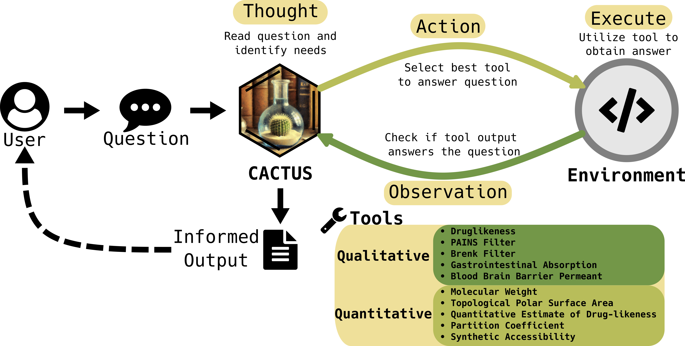

# CACTUS 🌵 | Chemistry Agent Connecting Tool Usage to Science

[](https://arxiv.org/abs/2405.00972)
[](https://rye-up.com)
[](https://opensource.org/licenses/BSD-2-Clause)
[](https://github.com/astral-sh/ruff)

# Introduction 

CACTUS is an innovative tool-augmented language model designed to assist researchers and chemists in various chemistry-related tasks. By integrating state-of-the-art language models with a suite of powerful cheminformatics tools, CACTUS provides an intelligent and efficient solution for exploring chemical space, predicting molecular properties, and accelerating drug discovery. Just as the cactus thrives in the harsh desert environment, adapting to limited resources and extreme conditions, CACTUS has been implemented by Pacific Northwest National Laboratory (PNNL) Scientists to navigate the complex landscape of chemical data and extract valuable insights.

 

# Preprint Available [here](https://arxiv.org/abs/2405.00972)

# Demo (API-only) on HuggingFace Spaces [here](https://huggingface.co/spaces/PNNL/cactus-demo)

## Running Cactus 🏃

Getting started with Cactus is as simple as:

```python
from cactus.agent import Cactus

Model = Cactus(model_name="google/gemma7b", model_type="vllm")
Model.run("What is the molecular weight of the smiles: OCC1OC(O)C(C(C1O)O)O")
```

## Installation 💻

To install `cactus`:

```bash
pip install git+https://github.com/pnnl/cactus.git
```

The default `PyTorch` version is compiled for `cuda` 12.1 (or cpu for non-cuda systems). If you want to install for an older version of `cuda`, you should install from source and edit the `pyproject.toml` file at the `[[tool.rye.sources]]` section before installing. But be aware `vllm` may not work properly for older versions of `PyTorch`.

Alternatively for development, you can install in an editable configuration using:

```bash
git clone https://gitlab.pnnl.gov/computational_data_science/cactus.git
cd cactus
python -m pip install -e .
```

or install using `rye` by running:

```bash
git clone https://gitlab.pnnl.gov/computational_data_science/cactus.git
cd cactus
rye sync
```

## Benchmarking 📊

We provide scripts for generating lists of benchmarking questions to evaluate the performance of the CACTUS agent.

These scripts are located in the `benchmark` directory.

To build the dataset used in the paper, we can run:

```bash
python benchmark_creation.py
```

This will generate a readable dataset named `QuestionsChem.csv` for use with the `Cactus` agent.

## Models Tested

For this application we are benchmarking the following models:

| Model        | model_name                  |
|--------------|-----------------------------|
| `llama2-7b`  | `meta-llama/Llama-2-7b-hf`  |
| `mistral-7b` | `mistralai/Mistral-7B-v0.1` |
| `gemma-7b`   | `google/gemma-7b-it`        |
| `falcon-7b`  | `tiiuae/falcon-7b`          |
| `MPT-7b`     | `mosaicml/mpt-7b`           |
| `Phi-2`      | `microsoft/phi-2`           |
| `OLMo-1b`    | `allenai/OLMo-1B`           |

These models were selected based on their strong performance in natural language tasks and their potential for adaptation to domain-specific applications.

## Tools Available

For the initial release, we have simple cheminformatics tools available:
| Tool Name                 | Tool Usage                                           |
|---------------------------|------------------------------------------------------|
| `calculate_molwt`         | Calculate Molecular weight                           |
| `calculate_logp`          | Calculate the Partition Coefficient                  |
| `calculate_tpsa`          | Calculate the Topological Polar Surface Area         |
| `calculate_qed`           | Calculate the Qualitative Estimate of Drug-likeness  |
| `calculate_sa`            | Calculate the Synthetic Accessibility                |
| `calculate_bbb_permeant`  | Calculate Blood Brain Barrier Permeance              |
| `calculate_gi_absorption` | Calculate the Gastrointestinal Absorption            |
| `calculate_druglikeness`  | Calculate druglikeness based on Lipinski's Rule of 5 |
| `brenk_filter`            | Calculate if molecule passes the Brenk Filter        |
| `pains_filter`            | Calculate if molecule passes the PAINS Filter        |

⚠️ Notice: These tools currently expect a SMILES as input, tools for conversion between identifiers are available but not yet working as intended. Fix to come soon.

## Future Directions

We are continuously working on improving CACTUS and expanding its capabilities for molecular discovery. Some of our planned features include:

    🧬 Integration with physics-based models for 3D structure prediction and analysis
    🔧 Support for advanced machine learning techniques (e.g., graph neural networks)
    🎯 Enhanced tools for target identification and virtual screening    
    📜 Improved interpretability and explainability of the model's reasoning process

We welcome contributions from the community and are excited to collaborate with researchers and developers to further advance the field of AI-driven drug discovery.

## Citation 

If you use CACTUS in your research, please cite our preprint: 
```bibtex
@article{mcnaughton2024cactus,
    title={CACTUS: Chemistry Agent Connecting Tool-Usage to Science},
    author={Andrew D. McNaughton and Gautham Ramalaxmi and Agustin Kruel and Carter R. Knutson and Rohith A. Varikoti and Neeraj Kumar},
    year={2024},
    eprint={2405.00972},
    archivePrefix={arXiv},
    primaryClass={cs.CL}
}
```
